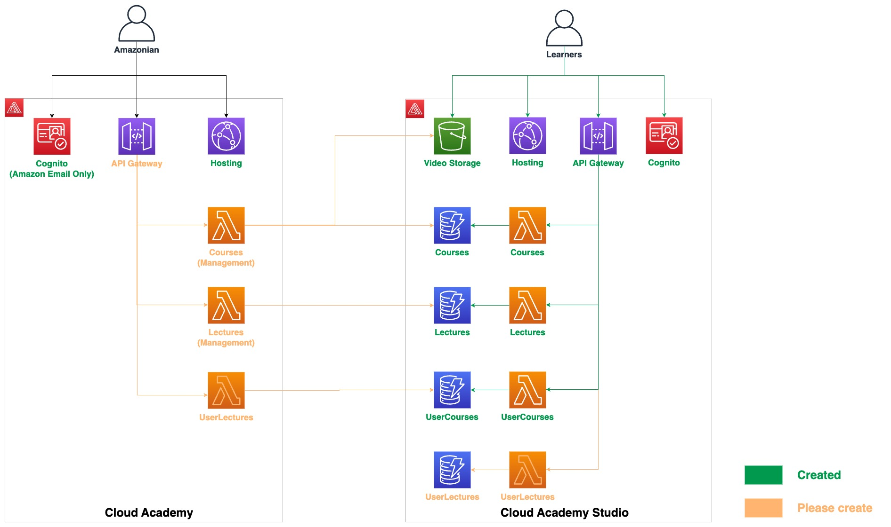

# LEARNING MANAGEMENT SYSTEM

## Table of Contents
1. [Architect Overview](#1-architect-overview)
2. [Clone Code](#2-clone-code)
3. [Download Amplify CLI](#3-download-amplify-cli)
4. [Init Amplify and Connect Your Local Environment to the Cloud](#4-init-amplify-and-connect-your-local-environment-to-the-cloud)
5. [Check Your Apps](#5-check-your-apps)
6. [Run Frontend from Your Local Laptop](#6-run-frontend-from-your-local-laptop)
    6.1. [How to Run LMS FE](#61-how-to-run-lms-fe)
    6.2. [How to Run LMS-Studio FE](#62-how-to-run-lms-studio-fe)
7. [Add Sample Data to DynamoDB Tables](#7-add-sample-data-to-dynamodb-tables)
8. [How to Contribute to the Source Code](#8-how-to-contribute-to-the-source-code)
9. [Publish the Application](#9-publish-the-application)
10. [Demo](#10-demo)
11. [Additional Step After Publishing](#11-additional-step-after-publishing)

---

## 1. Architect Overview

- Cloud Academy -> ***lms***
- Cloud Academy -> ***lms-studio***

## 2. Clone Code:

```
git clone https://github.com/vanhoangkha/MVP.git
```

After that, check out git branch **d_unicorm_gym_master**

## 3. Download Amplify CLI:
Follow below instructions in section "Install the Amplify CLI", and section "Configure the Amplify CLI":
[Amplify setup link](https://docs.amplify.aws/cli/start/install/#configure-the-amplify-cli)

**Note:** amplify configure will ask you to sign into the AWS Console. Remember to log into your own isengard account to sign into that AWS Console.
**Step:** "Specify the **AWS Region**" -> Choose **Singapore Region**.

## 4. Init Amplify and connect your local env to the Cloud:
- Check out git branch d_unicorm_gym_master before continuing.
- Open your local LMS root folder and do amplify setup with lms first:

```
cd lms/lms

(sudo) amplify init

? Enter a name for the environment: dev

? Choose your default editor: <Choose your favorite editor>

Using default provider  awscloudformation

? Select the authentication method you want to use: AWS profile

? Please choose the profile you want to use : <Choose the profile you created in Configure the Amplify CLI from section 2. Download Amplify CLI>

amplify push

```

- Similarly, do all the above steps in this section 3 for lms:
- Open your local LMS root folder, then:

```
cd lms/lms-studio

(sudo) amplify init
```

- When initializing lms-studio project, if amplify adds a table to import, select **courses-dev, lecture-resource ...**

```
amplify push
```

- We will create a policy to provide access to the S3 lecture resources with the following content:

```
{
    "Version": "2012-10-17",
    "Statement": [
        {
            "Action": [
                "s3:GetObject",
                "s3:PutObject",
                "s3:DeleteObject"
            ],
            "Resource": [
                "arn:aws:s3:::{s3-bucket-name}/public/*",
                "arn:aws:s3:::{s3-bucket-name}/protected/${cognito-identity.amazonaws.com:sub}/*",
                "arn:aws:s3:::{s3-bucket-name}/private/${cognito-identity.amazonaws.com:sub}/*"
            ],
            "Effect": "Allow"
        },
        {
            "Action": [
                "s3:PutObject"
            ],
            "Resource": [
                "arn:aws:s3:::{s3-bucket-name}/uploads/*"
            ],
            "Effect": "Allow"
        },
        {
            "Action": [
                "s3:GetObject"
            ],
            "Resource": [
                "arn:aws:s3:::{s3-bucket-name}/protected/*"
            ],
            "Effect": "Allow"
        },
        {
            "Condition": {
                "StringLike": {
                    "s3:prefix": [
                        "public/",
                        "public/*",
                        "protected/",
                        "protected/*",
                        "private/${cognito-identity.amazonaws.com:sub}/",
                        "private/${cognito-identity.amazonaws.com:sub}/*"
                    ]
                }
            },
            "Action": [
                "s3:ListBucket"
            ],
            "Resource": [
                "arn:aws:s3:::{s3-bucket-name}"
            ],
            "Effect": "Allow"
        }
    ]
}

```

- Then, create a role named "amplify-lmsstudio-prod-authRole" and attach the policy to it.
## 5. Check Your Apps Are On or Not:
- Open your own Isengard account and go to "Amplify" service to check if your app is now shown on or not (app names: lms, lmsstudio)

## 6. Run Frontend from Your Local Laptop:
### 6.1. How to Run LMS FE:
- Open your local LMS root folder, then:
```
cd LMS/lms/

npm i

npm start
```

### 6.2. How to Run LMS-Studio FE:
- Open your local LMS root folder, then:

```
cd LMS/lms-studio/

npm i

npm start
```

## 7. Add Sample Data to DynamoDB Tables
- Sample data for Course and Lecture tables are stored in the sample-data folder.
- You can add these data to DynamoDB using JSON view when creating a new item in DynamoDB Console.

## 8. How Can We Contribute to the Source Code ?
- Inside your cloned repository from section 1. From the d_unicorm_gym_master branch, create a new feature branch, naming convention: f_feature_name (E.g: f_create_course).

- You develop, test the project with that branch.

Development steps:

- Implement UI with React JS.
- Implement APIs and integrate with the UI:
    - API Gateway and DynamoDB tables are already created, the lambda function named studioCourses for /courses/ APIs is also created.
    - If you need to import DynamoDB table or S3 bucket from LMS to LMS Studio project, run amplify import storage.
    - If you need to add new APIs and lambda functions, run amplify update api and add a new path.
    - Use studio prefix for Lambda function name to avoid conflict with the LMS project. E.g: studioCourses, studioLectures.
    - Please use Node JS for your Lambda function to ensure consistency, and don’t create new API gateways.
## 9. To Publish the Application, We Execute the Command:

```
cd lms
amplify publish

cd lms-studio
amplify publish

```
## 10. Demo
- Demo AWS Cloud Academy Studio: AWS Cloud Academy Studio

- Demo AWS Cloud Solution Journey: Cloud Solution Journey

## 11. Additional Step After Publishing
After publishing, follow these additional steps:

- Go to Cognito User Pool.
- Select the "Sign-up experience" tab.
- In the "Custom attributes" section, click "Add custom attributes."
- Enter "name_on_certificate."

