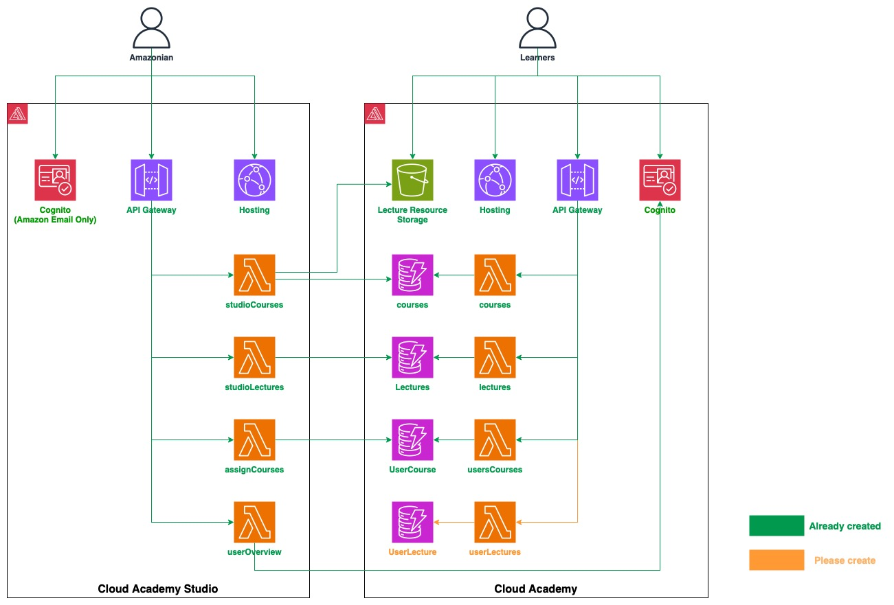

# LEARNING MANAGEMENT SYSTEM

## 1. Architect Overview

- Cloud Academy -> ***lms***
- Cloud Academy -> ***lms-studio***
## 2. Clone code:
```bash
$ git clone https://github.com/vanhoangkha/MVP.git
```

After that, check out git branch ```d_unicorm_gym_master```

## 2. Download Amplify CLI:  
Follow below instructions in section "Install the Amplify CLI", and section "Configure the Amplify CLI": 
[Amplify setup link](https://docs.amplify.aws/cli/start/install/#configure-the-amplify-cli)
* **Note**: amplify configure will ask you to sign into the AWS Console. Remember to log into your own isengard account to sign into that AWS Console.
* **Step**: "Specify the AWS Region" -> Choose Singapore Region.

## 3. Init Amplify and connect your local env to the Cloud:
- Check out git branch ```d_unicorm_gym_master``` before continue.
- Open your local LMS root folder and do amplify setup with ***lms*** first:
```bash
$ cd lms/lms

$ (sudo) amplify init

? Enter a name for the environment: dev

? Choose your default editor: <Choose your favorite editor>

Using default provider  awscloudformation

? Select the authentication method you want to use: AWS profile

? Please choose the profile you want to use : <Choose the profile you created in Configure the Amplify CLI from section 2. Download Amplify CLI>

$ amplify push
```

- Similarly, do all above steps in this section 3 for ***lms***:
Open your local LMS root folder, then:
```bash
$ cd lms/lms-studio

$ (sudo) amplify init
...
```
- When init ```lms-studio``` project, if amplify add for table to import, select ```courses-dev```, ```lecture-resource``` ...

```
amplify push
```

We will create a policy to provide access to the S3 lecture resources with the following content:

```json
{
    "Version": "2012-10-17",
    "Statement": [
        {
            "Action": [
                "s3:GetObject",
                "s3:PutObject",
                "s3:DeleteObject"
            ],
            "Resource": [
                "arn:aws:s3:::lecture-resource224559-prod/public/*",
                "arn:aws:s3:::lecture-resource224559-prod/protected/${cognito-identity.amazonaws.com:sub}/*",
                "arn:aws:s3:::lecture-resource224559-prod/private/${cognito-identity.amazonaws.com:sub}/*"
            ],
            "Effect": "Allow"
        },
        {
            "Action": [
                "s3:PutObject"
            ],
            "Resource": [
                "arn:aws:s3:::lecture-resource224559-prod/uploads/*"
            ],
            "Effect": "Allow"
        },
        {
            "Action": [
                "s3:GetObject"
            ],
            "Resource": [
                "arn:aws:s3:::lecture-resource224559-prod/protected/*"
            ],
            "Effect": "Allow"
        },
        {
            "Condition": {
                "StringLike": {
                    "s3:prefix": [
                        "public/",
                        "public/*",
                        "protected/",
                        "protected/*",
                        "private/${cognito-identity.amazonaws.com:sub}/",
                        "private/${cognito-identity.amazonaws.com:sub}/*"
                    ]
                }
            },
            "Action": [
                "s3:ListBucket"
            ],
            "Resource": [
                "arn:aws:s3:::lecture-resource224559-prod"
            ],
            "Effect": "Allow"
        }
    ]
}
```

- Then, create a role named "amplify-lmsstudio-prod-authRole" and attach the policy to it.

## 4. Check your apps are on or not:
Open your own isengard account and go to "Amplify" service to check if your app is now shown on or not (apps'name:  ***lms***, ***lmsstudio***)   

## 5. Run Frontend  from your local laptop:
###5.1. How to run lms FE:
Open your local LMS root folder, then:
```bash
$ cd LMS/lms/

$ npm i

$ npm start
```

###5.2. How to run lms-studio FE:
Open your local LMS root folder, then:
```bash
$ cd LMS/lms-studio/

$ npm i

$ npm start
```

## 6. Add sample data to dynamodb tables
Sample data for Course and Lecture tables are stored in sample-data folder.
You can add these data to DynamoDB using JSON view when create new item in DynamoDB Console.

## 7. How can we contribute to the source code ?
Inside your cloned repository from section 1. From the ```d_unicorm_gym_master``` branch, create a new feature branch, naming convention: ```f_feature_name``` (E.g: ```f_create_course```).

You develope, test the project with that branch.

Development steps:
- Implement UI with React JS.
- Implement APIs and integrate with the UI:
    - API Gateway and DynamoDB tables are already created, the lambda function named ```studioCourses``` for ```/courses/``` APIs is also created.
    - If you need to import DynamoDB table or S3 bucket from LMS to LMS Studio project, run ```amplify import storage```.
    - If you need to add new APIs and lambda functions, run ```amplify update api``` and add a new path.
    - Use ```studio``` prefix for Lambda function name to avoid conflict with the LMS project. E.g: ```studioCourses```, ```studioLectures```.
    - Please use Node JS for your Lambda function to ensure consistency, and don’t create new api gateway.


## 8 To publish the application, we execute the command:

```
cd lms
amplify publish

cd lms-studio
amplify publish

```

## 9 Demo

- Demo AWS Cloud Academy Studio: [AWS Cloud Academy Studio](https://prod.d3pussyvi8sdx8.amplifyapp.com/#/management/myLectures)

- Demo AWS Cloud Solution Journey: [Cloud Solution Journey](https://prod.dfd4pjr0efrj8.amplifyapp.com/)
